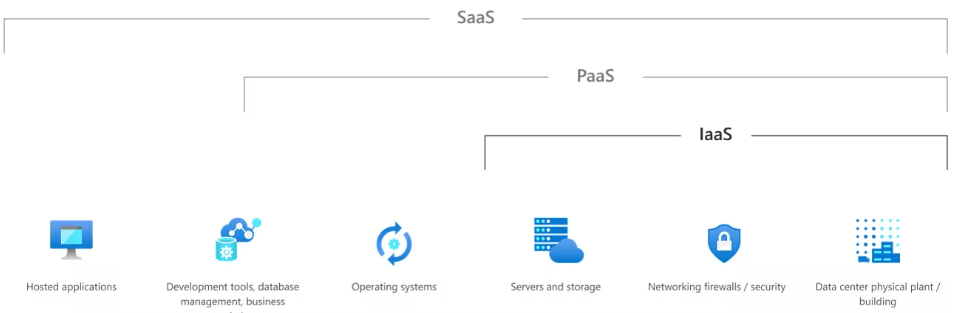

# SC-300

**Control plane:** is the part of a network that manages and directs traffic to resources based on specific criteria, with user identity being crucial for controlling access in modern solutions. Identity is the control plane for accessing resources.

**OpenID Connect (OIDC):** An authentication protocol built on OAuth2, where an OpenID Provider issues JSON identity tokens to relying parties through a RESTful API for identity services.

**SAML:** An open standard for exchanging authentication and authorization data between identity and service providers, using XML-based security assertions for access control decisions.

**WS-Federation**: is a federation protocol, which uses SOAP messages to transmit authentication information. It is used for compatibility with some older or specific systems, such as AD FS.

**Identity Management:**

- **Identity Proliferation:** Manages the storage of identity objects across multiple directories and identity stores.
- **Provision and Deprovision:** Handles the creation and removal of identity objects within systems.
- **Identity Updates:** Automates the updating of identity information across the environment.
- **Synchronization:** Ensures all identity systems are updated with the latest identity information.
- **Password Management:** Manages where and how passwords are set and recovered.
- **Group Management:** Controls how groups determine access permissions in systems like AD or LDAP.
- **Application Entitlement Management:** Manages how identities are granted application access, handling both coarse- and fine-grained entitlements.
- **User Interface:** Provides users with a method to request identity updates, often involving the Service Desk.
- **Change Control:** Oversees how changes to identity data flow through the environment, possibly through manual or automated processes.

**Microsoft Graph:** is a unified API endpoint that provides access to data and services across Microsoft cloud platforms, including Microsoft 365, Entra ID, and devices, enabling apps to manage identity, access, and insights.

**Centralized Identity**: Managed by a central authority (Entra ID), it stores and verifies user credentials in one system, providing unified access control and identity governance for both cloud and on-premises resources.

**Decentralized Identity**: Users control their own digital identity via decentralized identifiers (DIDs), allowing for self-ownership of credentials without relying on a central authority, and anchored in decentralized systems like blockchain for secure, immutable identity management.

- **W3C Decentralized Identifiers (DIDs)**: Globally unique IDs created and controlled by users, linked to decentralized public key infrastructure (DPKI) for authentication and security.
- **Decentralized systems**: Blockchains and ledgers used as the foundation for DIDs, ensuring secure, immutable identity management.
- **DID User Agents**: Applications that help users create and manage DIDs, as well as control permissions and data.
- **DIF Universal Resolver**: A service that resolves and returns DID Document Objects (DDO) containing metadata linked to a DID.
- **DIF Identity Hubs**: Distributed personal datastores that securely store and replicate identity data across cloud and edge devices.
- **DID Attestations**: Signed claims used to verify identities and enable trusted interactions between decentralized identity holders.
- **Decentralized apps and services**: Applications that use DIDs and Identity Hubs to securely interact with identity data under user-controlled permissions.

**Microsoft Entra External Identities**: A solution for securely interacting with external users, allowing them to bring their own identities (corporate, government, or social) to access your apps and resources.

- **Azure B2B**: Enables external organizations to collaborate with your internal users by allowing guest users to access your apps using their existing identity credentials.
    - **B2B collaboration**: Allows external users to sign in with their preferred identity and access your enterprise apps, appearing as guest users in your directory.
    - **B2B direct connect**: Establishes a two-way trust between Microsoft Entra organizations, allowing external users to collaborate seamlessly via shared Teams channels without being added to your directory.
- **Azure B2C**: A customer identity access management (CIAM) solution for businesses to let customers use social or enterprise accounts for secure, scalable access to their apps and APIs.

**Active Directory Domain Services (AD DS)**: An on-premises LDAP directory that offers core identity features like user authentication, group policies, and computer management, widely used in traditional IT environments for enterprise identity management.

**Microsoft Entra ID**: A cloud-based identity and access management solution providing user authentication for cloud resources like Microsoft 365 and Azure. It can synchronize with on-prem AD DS to offer a unified identity across environments.

**Microsoft Entra Domain Services**: A managed service offering a subset of traditional AD DS features (like domain join, LDAP, Kerberos) in Azure, integrated with Entra ID, extending identity management to cloud-based apps.

**Subscription**: An agreement to use Microsoft cloud services, with charges based on per-user license fees or cloud resource consumption, depending on the service (SaaS, PaaS, or IaaS).

**License**: A purchased right that allows a specific user to access Microsoft services, typically charged as a fixed monthly fee and assigned within a subscription.

- **Microsoft Entra ID P1/P2 license**: Grants access to advanced features in Microsoft Entra ID, including Privileged Identity Management (PIM) for P2.
- **Microsoft 365/Office 365/Windows licenses**: Assign access to specific Microsoft services like Office or Windows for individual users.
- **Monthly Active User (MAU) license**: Charges based on the number of external users logging into Microsoft Entra External Identities each month.

**Claims-based authentication: w**hen a user signs in, Microsoft Entra ID creates and sends an ID token that contains a set of claims about the user.

**Governance in Identity:** is the process of overseeing and ensuring the proper operation and security of identity systems. It involves monitoring, updating processes, and addressing outdated or mismanaged accounts to prevent system degradation and potential security risks.

**Identity Lifecycle Management:** automates and manages digital identities throughout their lifecycle (Join, Move, Leave). It ensures that identities are accurately created, updated, and removed based on authoritative data like HR systems.

---

**Company Branding:** You can customize your organization's login pages by adding a logo, color scheme, and custom text. Adding custom branding requires you to have either **Microsoft Entra ID premium P1, P2, or Office 365 license**

**Azure Roles**: Manage permissions for Azure resources with multi-level scope options like subscriptions and resource groups.

**Microsoft Entra Roles**: Manage permissions for Microsoft Entra resources at the tenant level, focused on identity management.

- **Global Administrators:** Manage all Microsoft Entra ID features, assign administrator roles and reset any user or administrator passwords
- **User Administrators:** Create and manage users and groups, manage support tickets, monitor service health and change passwords for users and other User Administrators
- **Billing Administrators:** Make purchases, manage subscriptions, manage support tickets and monitor service health
- **Application Administrator**: Manages all applications, including registrations, SSO settings, user/group assignments, licensing, and Application Proxy settings. Cannot manage Conditional Access.
- **Cloud Application Administrator**: Similar to Application Administrator but without access to Application Proxy settings.
- **Custom role**: Select **Microsoft Entra ID** - **Roles and administrators** - **New custom role**. Needs a name, a description and add the permissions.

**Administrative unit:** is a container for users, groups, and devices, allowing role-based management of specific subsets within the tenant, helping to enforce the principle of least privilege by restricting admin access to only defined sections.

- Define necessary roles.
- Delegate app administration, ownership, and registration.
- Assign limited permissions using built-in or custom roles.
- Create a security plan, secure admin roles, and set up emergency accounts.

**Primary Domain**: The default domain (e.g., contoso.onmicrosoft.com) is set when the tenant is created and can be changed by a Global Administrator to any verified custom domain.

**Custom Domains**: You can add up to 900 custom domains and manage subdomains. Verified subdomains are automatically added if the root domain is verified.

**Deletion of Domains**: Before deleting a custom domain, ensure no resources (users, groups, apps) rely on it. Use **ForceDelete** to rename references, but it has restrictions such as a 1000-object limit.

## Default config for users

- **Member Users**: Can register applications, manage profile info, change passwords, invite B2B guests, and read most directory info.
- **Guest Users**: Limited access; can manage profile, change password, view some user/app info but cannot access full directory details.

**Security Defaults**:

- **MFA Required**: All users and admins must register for and perform MFA.
- **Block Legacy Authentication**: Prevents older, less secure authentication methods.
- **Privileged Access**: MFA is required for critical tasks like accessing the Azure portal.
- **Free for All**: Security Defaults are available to all organizations at no extra cost.

**Identity Types:**

- **Cloud identities**: Users exist only in Microsoft Entra ID, managed internally or from another Entra directory.
- **Directory-synchronized identities**: Users synced from on-premises Active Directory via Microsoft Entra Connect.
- **Guest users**: External accounts (e.g., cloud providers, Microsoft accounts) invited for access to Azure resources.

**Deleted user:** account remains suspended for 30 days, allowing for restoration of the user and its properties. After 30 days, the account is permanently deleted. To restore or delete users, you need one of the following roles: Global administrator, Partner Tier-1 Support, Partner Tier-2 Support, or User administrator.

**Microsoft Entra Registered Devices**:

- Devices registered to Microsoft Entra ID, allowing personal devices (BYOD) to access organizational resources without needing a work account to sign in.
- **Key Aspects**: Local sign-in accounts, supports multiple OS (Windows, iOS, Android, macOS), managed through MDM (e.g., Intune), provides SSO and Conditional Access.

**Microsoft Entra Joined Devices**:

- Devices joined only to Microsoft Entra ID, requiring an organizational account for sign-in, suited for cloud-only or hybrid organizations.
- **Key Aspects**: Organization-owned devices, supports Windows 10 & 11 (excluding Home), managed via MDM, enables SSO to both cloud and on-premises resources.

**Hybrid Microsoft Entra Joined Devices**:

- Devices joined to both on-premises Active Directory and Microsoft Entra ID, requiring an organizational account for sign-in, ideal for hybrid environments.
- **Key Aspects**: Supports older Windows versions (7, 8.1), managed via Group Policy or Configuration Manager, allows SSO to cloud and on-premises resources.

**Device Writeback**: A feature that enables visibility of devices registered in Entra ID within on-premises AD, allowing conditional access policies to be applied based on device status.

**Potential issues with group-based licensing:**

- **Not Enough Licenses**
- **Service Plans That Conflict**: Conflicting service plans assigned to a user from different products prevent group license assignment.
- **Other Products Depend on This License**: Removing a group license causes issues if a required service plan for another product is disabled.
- **Usage Location Isn't Allowed**: License assignment fails if a user's usage location is not supported for the specified Microsoft services.
- **Duplicate Proxy Addresses**: Multiple users with the same proxy address cause license assignment errors.
- **Microsoft Entra Mail and ProxyAddresses Attribute Change**: License updates can unintentionally alter a user's Microsoft Entra Mail and ProxyAddresses attributes.
- **LicenseAssignmentAttributeConcurrencyException**: Concurrent license assignments to a user from multiple groups can cause exceptions, but are retried automatically.
- **More Than One Product License Assigned to a Group**: If any product in a group fails to assign, none of the licenses will be assigned to users.
- **When a Licensed Group is Deleted**: All licenses must be removed before a group can be deleted, which may lead to conversion of group licenses to direct assignments.
- **Manage Licenses for Products with Prerequisites**: Add-ons require prerequisite service plans in the same group to function correctly.
- **Force the Group License Process to Resolve Errors**: Manually triggering group processing may be needed to resolve errors after making changes.
- **Force the User License Process to Resolve Errors**: User processing may need to be manually triggered after resolving issues like duplicate proxy addresses.
- **How to Migrate Users with Individual Licenses to Group Licenses**: Care must be taken to avoid service interruptions during the migration from individual to group licenses.
- **Change License Assignments for a User or Group**: License changes should be made simultaneously to prevent loss of service or data during updates.

**Custom security attributes:** are key-value pairs in Microsoft Entra ID used to store business-specific information and manage access control, enabling tailored user profiles and resource categorization. They allow organizations to define unique attributes, govern access, and filter objects effectively.

**SCIM (System for Cross-Domain Identity Management)** is an open standard protocol that enables automatic synchronization and management of user identities and data between systems, facilitating the provisioning and deprovisioning of accounts in Microsoft Entra ID from systems such as HCM.

**Microsoft Entra Verified ID:** allows organizations to issue and verify digital credentials securely. It provides a decentralized identity solution, letting businesses create and validate credentials like driver's licenses or diplomas, ensuring privacy and security for users.

**Microsoft Entra Connect Cloud Sync:** enables hybrid identity by synchronizing users, groups, and contacts from Active Directory (AD) to Microsoft Entra ID using a cloud provisioning agent.

**Difference**: Entra Connect is more suitable for complex environments requiring extensive configuration, while Entra Connect Cloud Sync is aimed at simpler, more lightweight setups, especially in multi-forest scenarios.

**Microsoft Entra Connect:** links on-premises Active Directory with Entra ID, enabling identity synchronization across both platforms. It facilitates features like PHS, PTA, and federation integration, allowing users to access cloud and on-premises resources with a single identity.

- **Source Anchor**: is an immutable attribute that uniquely identifies an object both on-premises and in Microsoft Entra ID. Crucial for linking objects during sync operations
- Be careful in hybrid environments with UPN, the domain in UPN must be a verified domain in Entra ID
- **Connector Space (CS)**: Space where objects from each connected directory are temporarily stored before being processed.
- **Metaverse (MV)**: Space where objects that need to be synchronized are created, based on synchronization rules.
- **Sync rules**: Rules that determine which objects will be created or connected in the VM.
- **Run profiles**: They group the steps in the process of copying objects and attribute values according to synchronization rules.

**Entra Connect Topologies:**

- **Single Forest, Single Microsoft Entra Tenant:** One on-premises forest (can have multiple domains) linked to a single Microsoft Entra tenant.
    - Simplest and most common setup, ideal for straightforward identity management.
- **Multiple Forests, Single Microsoft Entra Tenant:** Multiple on-premises Active Directory forests connected to one Microsoft Entra tenant. All forests must be reachable by a single sync server.
    - Suitable for mergers or complex environments needing centralized identity management.
- **Multiple Forests, Single Sync Server, Users in Only One Directory:** Each forest is treated independently, with no user duplication across forests. They share a unified global address list (GAL) in Microsoft Entra ID.
    - Often seen in mergers or organizations where business units operate separately.
- **Multiple Forests: Full Mesh with Optional GALSync:** Users and resources can be located in any forest with two-way trusts. Optionally uses GALSync to share user information across forests.
    - **Use Case**: Ideal for environments needing interconnected resource access and shared services.
- **Multiple Forests: Account-Resource Forest:** One resource forest that trusts all account forests, hosting services like Exchange and Teams. Users have disabled accounts in the resource forest linked to their account forests.
    - Useful for organizations needing centralized resources and services.
- **Staging Server:** A second sync server that reads data but does not write it. It keeps an updated copy of identity data.
    - Supports disaster recovery and testing without affecting production data.
- **Multiple Microsoft Entra Tenant:** Each Microsoft Entra tenant requires its own sync server. Users in one tenant cannot see users in another.
    - For organizations needing strict separation of user environments.
- **Each Object Only Once in a Microsoft Entra Tenant:** Each sync server connects to one tenant and is configured to filter objects to avoid overlaps.
    - Suitable for managing distinct sets of users across different domains or organizational units.

**Device writeback:** is used to enable device-based conditional Access for ADFS-protected devices. This provides extra security and assurance that access to applications is granted only to trusted devices. Synchronizes all devices registered in Azure back to the on-premises AD

**Errors during Synchronization**: 

- **InvalidSoftMatch:** When there is no hard match (ImmutableId), nor soft match (SoftMatch), an object is found with a different ImmutableId but with duplication of attributes such as ProxyAddresses or UserPrincipalName.
- **ObjectTypeMismatch:** Error trying to do a soft match between objects of different types (user, group, etc.) with the same key attributes.
- **AttributeValueMustBeUnique:** Error caused by two objects having the same value in unique attributes such as ProxyAddresses or UserPrincipalName.
- **IdentityDataValidationFailed:** The data does not meet the format or valid character requirements in Microsoft Sign In ID (eg. UserPrincipalName).
- **FederatedDomainChangeError:** Error changing UserPrincipalName suffix between different federated domains.
- **LargeObject:** An attribute exceeds the allowed size or quantity limits (e.g. userCertificate, proxyAddresses).
- **AdminRoleConflict:** Occurs when a synchronized object has the same UserPrincipalName as an object with an administrative role in Microsoft Entra ID.

**Common Solutions**

- Identify and correct duplicates in ProxyAddresses or UserPrincipalName.
- Correct attribute formats.
- Remove duplicate values or adjust administrative roles in Microsoft Enter ID before synchronization.

**Microsoft Entra Connect Health**: Monitors on-premises identity infrastructure, ensuring a reliable connection to Microsoft 365 and Online Services. It provides alerts, performance monitoring, and usage analytics in a centralized portal. Requires a Microsoft Entra ID Premium P1 license.

- Owner: Manage access, view all information and change settings.
- Contributor: View all information and change settings.
- Reader: View all information only.

Entra Connect Health offers **self-service remediation for duplicated attribute sync errors**, including UserPrincipalName and ProxyAddresses conflicts. It provides diagnostic steps to narrow down issues and apply fixes directly from Microsoft Entra ID. After diagnosing the issue, a fix can be applied, and errors are resolved after the next sync cycle.

---

**Microsoft Entra ID features:**

- **Password complexity rules:** Enforces the creation of strong, hard-to-guess passwords.
- **Password expiration rules:** Requires users to change their passwords periodically and prevents reuse of old passwords.
- **Self-service password reset (SSPR):** Allows users to reset their passwords independently without IT assistance.
- **Microsoft Entra ID Protection:** Automatically blocks or remediates risky behaviors based on risk-based policies.
- **Microsoft Entra password protection:** Blocks commonly used and compromised passwords using a global banned list.
    - **Proxy**: Downloads the password policy from Microsoft Ingres and sends it to domain controllers (DCs).
    - **Domain Controller** (**DC**): Checks user passwords using the policy downloaded from the proxy and rejects weak passwords. Requires at least two proxies to ensure availability
        
        
        
- **Microsoft Entra smart lockout:** Locks out malicious sign-in attempts like brute-force attacks while distinguishing legitimate users.
    - By default, 10 failed attempts, locked for 1 minute; time increases with additional attempts (exact growth is not disclosed).
    - The last three incorrect passwords are logged to avoid incrementing the lockout counter for the same repeated attempt.
    - Works in hybrid environments
    - Microsoft Entra P1 or P2
- **Microsoft Entra application proxy:** allows secure remote access to on-premises applications. It enables single sign-on (SSO) for these applications.
    - Uses Kerberos to support integrated Windows authentication for local applications. Users log in to applications without needing to enter their passwords again if they are already logged into their Windows accounts.
    - A user authenticated in Entra ID wants to access an on-premises application. The authentication for this application utilizes Kerberos. Essentially, the Application Proxy checks that the user is authenticated with Entra ID and exchanges the Entra ID token for a Kerberos token, allowing the user to access the application.

**MFA methods:**

**Microsoft Pluton Security Processor:** is a security processor integrated directly into the CPU, eliminating the vulnerability in communication between the CPU and the TPM chip. It protects credentials, identities, encryption keys and personal data, even against physical attacks or malware.

**Conditional Access best practices:**

- Create tests users and a test plan
- Set up at least emergency access accounts to prevent lockouts.
- Review each CA policy carefully to avoid misconfigurations, starting with a small group of users and excluding admins to ensure access if changes are needed.
- Use report-only mode to assess the impact of CA policies before applying them.
- Deploy policies in phases, test with small user sets, and expand gradually, ensuring at least one admin is unaffected by policies
- Block sign-ins from unexpected countries by creating named location policies.

**Conditional Access common policies:**

- **Require MFA**: Enforce MFA for admins, specific apps, all users, or untrusted network locations.
- **Respond to compromised accounts**: Enable default policies for MFA registration, password changes for high-risk users, and MFA for medium or high-risk sign-ins.
- **Require managed devices**: Limit access to sensitive resources by requiring users to connect through managed devices.
- **Require approved client apps**: In BYOD scenarios, manage access through approved cloud apps to protect corporate data.
- **Block access**: Use block policies to restrict access to apps or locations, but always exclude emergency and admin accounts to prevent lockouts.

**Conditional Access App Control:** is a feature within Microsoft Defender for Cloud Apps that monitors and controls user sessions and access to cloud applications in real time. It focuses on enforcing security during app sessions based on specific risk conditions, such as blocking downloads, uploads, or activities in sensitive scenarios.

- **Prevent data exfiltration**: Block download, cut, copy, and print of sensitive documents on unmanaged devices.
- **Protect on download**: Require sensitive documents to be labeled with Azure Information Protection before download.
- **Prevent upload of unlabeled files**: Block upload of sensitive files until they are properly labeled and classified.
- **Monitor user sessions**: Track and analyze user sessions to identify risky behavior and apply future policies.
- **Block access**: Restrict access to specific apps or users based on risk factors, such as device management settings.
- **Block custom activities**: Scan and block risky activities, like sending sensitive messages in apps like Microsoft Teams or Slack.
- **App protection**: Use Conditional Access to restrict cloud app access to approved, modern-authentication-capable apps.

**Intune App Protection:** secures company data at the app level, focusing on managing and protecting work data within specific applications, regardless of whether the device is enrolled in management. It applies restrictions like preventing data sharing between apps or requiring a PIN to access work-related apps.

**Sign-in frequency policies:** ensure users are prompted to sign in based on predefined time intervals. In scenarios with Microsoft Entra joined or hybrid devices, unlocking the device can reset the sign-in timer. For example, if the sign-in frequency is set to one hour, users are prompted again after one hour unless they unlock their device, which restarts the timer.

**Continuous Access Evaluation (CAE):** is a real-time mechanism that enforces CA policies by continuously evaluating user sessions and instantly revoking access if security conditions change, like user termination or location shifts.

## Identity Protection

**Identity Protection:** helps organizations assess account security by automating risk detection and remediation, enabling risk investigation, and allowing data export for third-party analysis. It requires a P2 license.

| **Anonymous IP address** | Sign in for example: Tor browser, anonymizer VPNs |
| --- | --- |
| **Atypical travel** | Sign in from an atypical location based on the user's recent sign ins. |
| **Malware-linked IP address** | Sign in from a malware-linked IP address. |
| **Unfamiliar sign in properties** | Sign in with properties we've not seen recently for the given user. |
| **Leaked credentials** | Indicates that the user's valid credentials have been leaked. |
| **Password spray** | Indicates that multiple usernames are being attacked using common passwords in a unified brute-force manner. |
| **Microsoft Entra threat intelligence** | Microsoft's internal and external threat intelligence sources have identified a known attack pattern. |
| **New country** | This detection is discovered by Microsoft Defender for Cloud Apps (MDCA). |
| **Activity from anonymous IP address** | This detection is discovered by MDCA. |
| **Suspicious inbox forwarding** | This detection is discovered by MDCA. |

| **Role** | **Can do** | **Can't do** |
| --- | --- | --- |
| Global Administrator | Full access to Identity Protection |  |
| Security Administrator | Full access to Identity Protection, can change politics | Reset password for a user |
| Security Operator | View all Identity Protection reports and Overview screen, Dismiss user risk, confirm safe sign-in, confirm compromise, respond to alerts | Configure or change policies, Reset password for a user, Configure alerts |
| Security Reader | View all Identity Protection reports and Overview screen | Configure or change policies, Reset password for a user, Configure alerts, Give feedback on detections |

**Report Navigation and Actions:** Each report displays detections for a selected period and allows customization of columns and filtering options. Administrators can perform actions on individual entries, such as resetting passwords, confirming user compromise, or dismissing risks.

- **Self-Remediation with Risk Policy**: Users can unblock themselves using multifactor authentication (MFA) and self-service password reset (SSPR) if enabled in the risk policy.
- **Manual Password Reset**:
    - **Temporary Password**: Generate a temporary password for immediate restoration, requiring user notification.
    - **Require Password Reset**: Force users to reset their passwords, applicable only for users registered for MFA and SSPR.
- **Dismiss User Risk**: Close all risk detections without affecting the existing password, keeping the user from being considered at risk.
- **Close Individual Risk Detections Manually**: Admins can lower the user risk level by manually confirming or dismissing specific risk detections based on investigations.
- **Unblocking Users**:
    - **For User Risk**:
        - Reset the user’s password.
        - Dismiss user risk to reduce the risk level.
        - Exclude or disable the user from the risk policy if it is causing issues for specific users
        - Disable policy if is causing issues to all users
    - **For Sign-In Risk**:
        - Sign in from a familiar location or device.
        - Exclude or disable the user from the sign-in policy if it is causing issues for specific users
        - Disable policy if is causing issues to all users

**Identity Protection for Workload Identities**: Unlike traditional user accounts, workload identities do not support multifactor authentication, lack formal lifecycle processes, and need to store credentials or secrets, making them harder to manage and more susceptible to compromise.

- **Microsoft Entra Threat Intelligence**: Identifies activities consistent with known attack patterns.
- **Suspicious Sign-ins**: Flags unusual sign-in properties for service principals, learning baseline behavior over 2-60 days.
- **Unusual Credential Additions**: Detects suspicious additions of privileged credentials to an OAuth app, indicating potential compromise.
- **Admin Confirmed Account Compromise**: Marks an account as compromised when an admin confirms it through the interface or API.
- **Leaked Credentials**: Identifies valid credentials that have been exposed, often through public repositories or data breaches.

**Microsoft Defender for Identity (Advanced Threat Detection):** identifies, detect, and investigate advanced threats, compromised identities, and insider actions targeting organizations. It leverages on-premises Active Directory signals to enhance security in hybrid environments.

**Key Vault:** 

- **Key Vault Administrator**: Has full access to data operations in the key vault, including certificates, keys, and secrets, but cannot manage vault resources or assign roles.
- **Key Vault Certificates Officer**: Can perform any action on the certificates in the key vault but cannot manage permissions.
- **Key Vault Secrets Officer**: Can perform any action on the secrets in the key vault but cannot manage permissions.
- **Key Vault Crypto Officer**: Can perform any action on the keys in the key vault but cannot manage permissions.
- **Key Vault Crypto Service Encryption User**: Can read metadata of keys and perform wrap/unwrap operations.
- **Key Vault Crypto User**: Can perform cryptographic operations using keys.
- **Key Vault Secrets User**: Can read the contents of the secrets stored in the key vault.
- **Key Vault Reader**: Can read metadata of key vaults and their certificates, keys, and secrets, but cannot view sensitive values.

## Global Secure Access

**Microsoft Entra Internet Access:** secures access to public internet applications like Microsoft services and SaaS apps (e.g., Office 365), using an identity-focused Secure Web Gateway. It protects against internet threats, applies Conditional Access policies universally, and controls web access based on content categories.

**Steps to deploy Microsoft Entra Internet Access:**

1. **Enable the Microsoft Traffic Forwarding Profile**: In the Microsoft Entra Admin Center, **Global Secure Access > Connect > Traffic Forwarding**.
    
    **Why**: This step makes sure that any traffic going to important Microsoft services, like Exchange and SharePoint, is routed through a secure network, allowing you to monitor and protect it.
    
2. **Install the Global Secure Access Client on End-User Devices**: Download the Global Secure Access Client app from the admin center and install it on users' devices (either manually or through a tool like Intune).
    
    **Why**: The client ensures all user traffic is captured and controlled, helping secure their access to company resources from any location.
    
3. **Enable Tenant Restrictions**: Configure tenant restrictions under **Identity > External Identities > Cross-tenant access settings** to define which external organizations are allowed or blocked.
    
    **Why**: Tenant restrictions help you control which organizations your users can interact with, preventing access to untrusted or risky external tenants.
    
4. **Enable Enhanced Global Secure Access Signaling and Conditional Access**: Turn on Global Secure Access signaling under **Global Secure Access > Global Settings > Session Management > Tenant Restrictions**, then set up Conditional Access policies.
    
    **Why**: This helps add extra security by making sure that users connect from safe networks and meet certain conditions like using a trusted device, which reduces the risk of attacks.
    

**Microsoft Entra Private Access:** provides secure, Zero Trust-based access to internal corporate apps and resources, without needing a VPN. It offers adaptive, per-app access to private apps in hybrid and multicloud environments, modernizing legacy app authentication with Conditional Access policies.

**Steps to deploy Microsoft Entra Private Access:**

1. **Configure a Microsoft Entra Private Network Connector and Connector Group**: Install the Microsoft Entra private network connector on a Windows Server in your on-premises environment and group connectors to manage specific applications.
    
    **Why**: This creates a secure connection between your on-premises resources and Global Secure Access, allowing your users to access private resources remotely.
    
2. **Configure Quick Access to Your Private Resources**: Set up Quick Access by defining the fully qualified domain names (FQDNs) or IP addresses of your private resources.
    
    **Why**: It ensures that only authorized resources are accessible through Microsoft Entra Private Access, securing your internal applications.
    
3. **Enable the Private Access Traffic Forwarding Profile**: Turn on the Private Access profile under **Global Secure Access > Connect > Traffic Forwarding** to direct traffic to your private network.
    
    **Why**: This step routes user traffic to internal resources securely without using a VPN, allowing for easier remote access management.
    
4. **Install and Configure the Global Secure Access Client on End-User Devices**: Deploy the Global Secure Access Client on user devices, either manually or via Intune.
    
    **Why**: The client captures user traffic, directing it securely through the configured private network, enabling seamless access to internal resources.
    

**Global Secure Access Dashboard:**

- **Global Secure Access snapshot**: Shows an overview of users, devices, and workloads using the service in the last 24 hours and how many apps were secured
- **Alerts and notifications**: Displays network health alerts and suspicious activities.
- **Usage profiling**: Highlights usage patterns based on transactions, users, devices, and data exchanged.
- **Top used destinations**: Lists the most visited destinations by traffic type, transactions, users, devices, or data transferred.
- **Cross-tenant access**: Tracks the number of users and devices accessing external tenants.
- **Web category filtering**: Displays top web content categories being blocked or allowed.
- **Device status**: Monitors active and inactive devices over the last 24 hours and seven days.

**Remote Network:** connects your remote offices or networks to Global Secure Access so you can apply security policies to internet traffic, without having to install software on the devices. Secures all remote network traffic through a secure tunnel (IPSec) to the cloud.

1. **Basics**: Define network name and region.
2. **Connectivity**: Enter details of the on-premises router (device type, IP, bandwidth).
3. **Traffic Forwarding**: Assign a profile to manage traffic types.
4. **Review Configuration**: Confirm and collect settings for the on-premises router.
5. **Setup Router**: Configure the router using Microsoft connectivity settings.

Global Secure Access se puede utilizar con CA y con herramientas de análisis de logs, repasar estas partes si hay muchas preguntas

---

**CASB** - **Cloud Access Security Broker:** An on-premises or cloud-based security policy enforcement point, placed between cloud service consumers and cloud service providers to combine and interject enterprise security policies as the cloud-based resources are accessed.

**MDCA** - **Microsoft Defender for Cloud Apps:** The Microsoft implementation of a CASB that enhances security for cloud applications by providing visibility, control over data travel, and advanced analytics. It offers features like Cloud Discovery 

**MDCA Cloud Discovery**: analyzes your organization’s traffic logs to identify and assess the cloud applications in use. It provides visibility into Shadow IT by dynamically discovering cloud apps and enabling organizations to understand their cloud app landscape.

- **Log Analysis:** Cloud Discovery utilizes traffic logs from firewalls or proxies to identify cloud apps being accessed within the organization.
- **Manual Uploads:** Administrators can manually upload log files for a one-time analysis or set up continuous reporting by using MDCA log collectors to periodically forward logs.
- **Dashboard Insights:** The Cloud Discovery Dashboard presents a high-level overview of cloud app usage, top categories, and specific app details, including risk scores and user statistics.
- **Filtering Options:** Users can filter discovered apps based on tags, categories, compliance and risk factors, security measures, and usage statistics to evaluate app security and compliance effectively.
- **Sanction**: Organisations can sanction or unsanction apps after performing safety assessments

**Connectors**: Tools or APIs that integrate external systems or apps with a platform (e.g., MDCA), enabling data exchange, visibility, and control between the connected services

**Usage and insights report**: Displays application sign-in data, including successful/failed sign-ins, success rate, and allows for viewing detailed sign-in activity per application over a selected date range.

**My Apps portal**: A web-based portal in Microsoft Entra ID that allows users to discover, launch, and manage access to applications, create personal app collections, and request new applications, without needing an Azure or Microsoft 365 subscription.

**Application Object**: Represents the global definition of an app within its home directory in Microsoft Entra ID. It defines how the app interacts with the identity provider, including settings like SSO, API permissions, and roles. It exists only in its original directory, even for multi-tenant apps.

**Service Principal**: A local instance of the application object in any directory where the app is used. It governs the app's specific permissions, role assignments, and settings within that directory.

**Scope**: is a set of permissions that one app can request to access specific resources in another app (such as an API). For example, if your app needs to read employee data, you can request a scope called Employees.Read.All.

**Delegated Permissions**: These permissions are used by applications that operate with a signed-in user. The permissions are granted based on the user's consent, meaning the application can act on behalf of the signed-in user when accessing resources. The effective permissions are limited to the least privilege of both the application permissions and the signed-in user's privileges.

**Application Permissions**: These permissions are used by applications that run without a signed-in user, such as background services. Only an administrator can consent to these permissions, allowing the application to have full access to resources as defined by the granted permissions without user restrictions.

**App Governance in Microsoft Defender for Cloud Apps (MDCA):** provides visibility, governance, and policy management for OAuth-enabled applications accessing Microsoft 365 data. It enables organizations to monitor app activity, enforce compliance policies, detect anomalies, and respond to security risks related to third-party app access.

---

## Identity Governance

**Microsoft Entra Entitlement management:** is a feature in Microsoft Entra ID that simplifies and automates the management of user access to resources, both for internal employees and external users, ensuring correct and timely access based on policies.

- **Access packages:** are bundles of resources (like groups, apps, and SharePoint sites) that users can request access to, with defined policies controlling who can request, approve, and how long access lasts.
- **Catalog:** is a container that groups related resources and access packages, used primarily for delegation, allowing non-administrators to create access packages.
- **Connected organization**: is an external organization you collaborate with, allowing its users to request access to your resources (like SharePoint or apps) by being represented in your directory through entitlement management.

**Access Review:** planned review of the access needs, rights, and history of user access. It help users ensure that the right people have the right access to the right resources. They mitigate access risk by protecting, monitoring, and auditing access to critical assets. Access reviews should be planned for:

- Access packages
- Security groups membership and ownership
- Exclusion security groups in CA policies
- On-premises groups
- Applications
- Microsoft Entra and Azure Roles
- **Automating Access Removal**: You can enable automatic access removal after an Access Review by setting "Auto apply results to resource" to **Enable**. This removes users not approved by the reviewer from groups, applications, or privileged roles after the review ends.
- **Recommendations**: If reviewers don’t respond, selecting "Take recommendations" automatically applies these suggestions based on configured criteria.
- **Reviewing Guest User Access**: Access Reviews can clean up external identities (guest users) who were invited via groups, Teams, applications, or privileged roles. Reviews can be configured to target **Everyone** or focus solely on **Guest users**, streamlining the review of external access.

**PIM**: 

- **Time-based access**: Assign time-bound access with start and end dates.
- **Just-in-time elevation**: Eligible users must elevate privileges to access roles, often requiring approval or MFA.
- **Access reviews**: Automates reviews of role assignments to ensure users still need access.
- **Principle of Least Privilege**: Minimize permanent assignments. Use PIM to assign eligible roles and require users to activate them only when necessary. Prefer zero permanent Global Administrators except for break-glass accounts.
- **Notifications**: PIM can send notifications when privileged roles are activated.
- **Approvals:** can be required for roles with the most access, such as Global and Security Administrators.

**PIM Group:** is a designated group that allows its members to gain temporary access to multiple privileged roles. Users can activate their membership to access these roles as needed, rather than having constant access. 

**Audit** **section:** allows administrators to view resource activity for privileged access groups and enables users to review their personal role activities, with options to filter by date for better tracking and accountability.

**Emergency access account:** is a highly privileged, cloud-only account created for critical situations where normal administrative access is unavailable, such as outages or the departure of key personnel. 

- Must not be tied to individual users or devices
- Utilize distinct authentication mechanisms
- Permanent Global Administrator roles.
- Exclude at least one account from multi-factor authentication and Conditional Access policies to ensure access during emergencies.
- Regular monitoring, validation, and documentation of procedures for these accounts are essential to guarantee their availability and security

**Discovery and insights:** can find privileged role assignments across Microsoft Entra ID, and then provide recommendations on how to secure them using Microsoft Entra governance features like PIM.

**Microsoft Entra Permissions Management:** is a cloud infrastructure entitlement management (CIEM) solution that provides visibility into identity permissions. It detects, right-sizes, and monitors unused or excessive permissions, crucial for least privilege access in a Zero Trust framework. It helps organizations assess permission risks, adjust permissions based on usage, and monitor for anomalous activities using machine learning alerts.

**Permissions Management Dashboard:** gives an overview of security risks related to user permissions in your cloud environment. It helps you identify users or systems with unnecessary access by showing the difference between permissions granted and permissions actually used, so you can take action to reduce risks.

- Highest PCI Change list view and the Permissions Creep Index (PCI) Heat Map gives you a quick glance at the status of your cloud environment
- **Analytics tab** gives detailed insights into the permissions each identity (Users, Groups, Resources, Tasks, Access Keys, and Serverless Functions) has in your cloud environment and how those permissions are used. It shows:
- **System Reports:** include information on access keys, user roles, group entitlements, identity permissions, and the history of the Permissions Creep Index (PCI).
